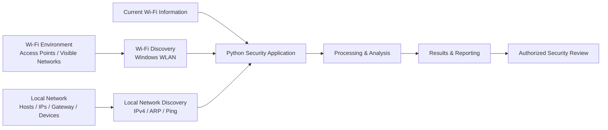
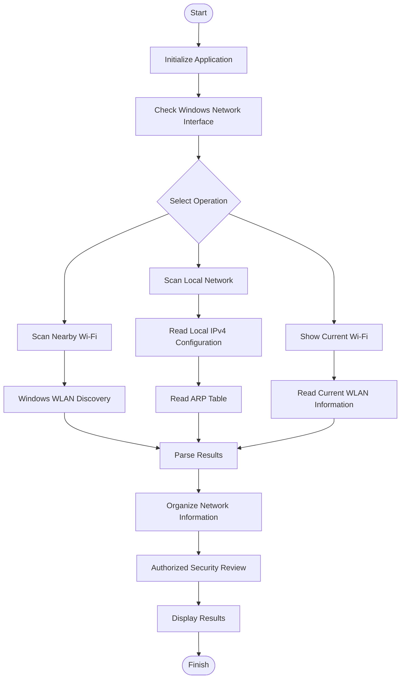

# 🛡️ Wi-Fi Discovery & Local Network Audit

**Windows Wi-Fi Discovery • Local Network Enumeration • Authorized Security Auditing**

A Python-based cybersecurity learning project for discovering nearby Wi-Fi networks and analyzing the local network in an authorized environment.

---

## ⚠️ Ethical Use & Legal Notice

> **AUTHORIZED USE ONLY**

This project is intended for:

- Educational cybersecurity laboratories
- Personal networks
- Authorized penetration testing
- Network administration
- Security research
- Defensive security learning

Only scan networks and systems that you **own or have explicit permission to assess**.

Do not use this project to access, disrupt, intercept, or attack networks without authorization.

---

# 📖 Overview

**Wi-Fi Discovery & Local Network Audit** is a Python-based Windows cybersecurity project designed to help students, security researchers, and network administrators understand Wi-Fi visibility and local-network discovery.

The project combines Python automation with native Windows networking commands to provide a simple security-lab environment.

### 🎯 Project Goals

- 📡 Discover nearby Wi-Fi networks
- 🔎 Inspect Wi-Fi security information
- 🌐 Identify the local IPv4 network
- 🖥️ Discover devices visible through the local ARP table
- 📋 Display local network configuration
- 🧪 Practice authorized security auditing
- 🐍 Learn Python security automation
- 🪟 Work with Windows networking and PowerShell
- 🛡️ Understand defensive network-security concepts

---

# 🚀 Features

## 📡 Wi-Fi Discovery

Discover and inspect Wi-Fi information available to the local Windows system.

Information can include:

- SSID
- BSSID
- Signal strength
- Channel
- Radio type
- Authentication
- Encryption

Useful for:

- Wi-Fi visibility
- Network identification
- Security-learning exercises
- Local network troubleshooting

---

## 🌐 Local Network Discovery

The project can inspect the computer's local IPv4 configuration and discover devices visible through the Windows ARP table.

Information can include:

- Computer hostname
- Local IPv4 address
- Subnet
- Default gateway
- MAC addresses
- Local devices
- Hostnames when available

---

## 🖥️ Windows Security Lab GUI

The Windows security-lab application provides a graphical interface for common discovery operations.

Available operations include:

- **Scan Nearby Wi-Fi**
- **Scan My Network**
- **Current Wi-Fi**
- **Clear**

The application is designed for authorized local-network security testing and educational laboratory use.

---

# 🧪 Cybersecurity Laboratory

This repository contains multiple scripts for practicing cybersecurity concepts in a controlled environment.

The laboratory focus includes:

- Wi-Fi discovery
- Network enumeration
- Local network analysis
- Windows networking
- Security auditing concepts
- Python automation
- Security-tool development
- Defensive security concepts

---

# 🏗️ Architecture Diagram

The architecture below shows how the major components of the project interact, from the Wi-Fi and local network environment through discovery, processing, analysis, reporting, and security review.

## Architecture Overview

<p align="center">
  
</p>

### System Architecture



---

## 🧱 Architecture Layers

| Layer | Components | Purpose |
|---|---|---|
| Target Environment | Wi-Fi Networks, Local Network | Authorized environment being assessed |
| Application Layer | Python Scripts, GUI | Provides the main application functionality |
| Discovery Layer | Wi-Fi Discovery, Network Discovery | Identifies visible networks and local devices |
| Data Layer | IPv4, ARP, WLAN Information | Collects network information |
| Processing Layer | Parsing, Analysis | Organizes collected information |
| Security Layer | Authorized Security Review | Supports defensive security analysis |
| Output Layer | Results and Reports | Presents collected information |

---

# 🔄 Workflow Diagram

The workflow below shows the complete process used by the project.

## Workflow Overview

<p align="center">
  
</p>

### GitHub Workflow Diagram



---

# 🔬 Detailed Workflow

```text
┌──────────────────────────┐
│          START           │
└────────────┬─────────────┘
             │
             ▼
┌──────────────────────────┐
│   Initialize Python      │
│       Security Lab       │
└────────────┬─────────────┘
             │
             ▼
┌──────────────────────────┐
│ Check Windows Wi-Fi      │
│ Network Interface        │
└────────────┬─────────────┘
             │
             ▼
      ┌───────────────┐
      │ Select Action │
      └───────┬───────┘
              │
       ┌──────┼───────┐
       │      │       │
       ▼      ▼       ▼
    Wi-Fi   Local   Current
    Scan    Network  Wi-Fi
       │      │       │
       ▼      ▼       ▼
     WLAN   IPv4    WLAN
   Discovery Config  Info
       │      │       │
       │      ▼       │
       │     ARP      │
       │     Table    │
       └──────┼───────┘
              │
              ▼
      ┌─────────────────┐
      │  Parse Results  │
      └────────┬────────┘
               │
               ▼
      ┌─────────────────┐
      │  Analyze Data   │
      └────────┬────────┘
               │
               ▼
      ┌─────────────────┐
      │ Security Review │
      └────────┬────────┘
               │
               ▼
      ┌─────────────────┐
      │ Display Results │
      └────────┬────────┘
               │
               ▼
        ┌─────────────┐
        │    DONE     │
        └─────────────┘
```

---

# 🧰 Scripts

## `wifi_authorized_audit.py`

Wi-Fi and local-network auditing functionality.

Learning areas include:

- Wi-Fi discovery
- Local network information
- Authorized network enumeration
- Security-oriented output

---

## `kali_security_lab.py`

Security-lab functionality for controlled cybersecurity experimentation.

---

## `kali_security_lab_windows.py`

Windows-oriented security-lab implementation.

The application provides a graphical interface with functions such as:

```text
Scan Nearby Wi-Fi
Scan My Network
Current Wi-Fi
Clear
```

---

## `wifi_handshake_lab.py`

Wi-Fi security laboratory component intended for controlled and authorized experimentation.

Use only with networks and wireless equipment that you own or have explicit authorization to test.

---

# 📂 Project Structure

```text
wifi-discovery-local-network-audit/
│
├── README.md
├── .gitignore
│
├── kali_security_lab.py
├── kali_security_lab_windows.py
├── wifi_authorized_audit.py
├── wifi_handshake_lab.py
│
└── images/
    ├── architecture diargam.png
    ├── workflow diagram.png
    └── poster.png
```

---

# 💻 Requirements

## Operating System

Recommended:

```text
Windows 10 / Windows 11
```

## Python

Python 3.x is recommended.

Check your Python installation:

```powershell
python --version
```

or:

```powershell
py --version
```

---

# ⚙️ Installation

## 1. Clone the Repository

```powershell
git clone https://github.com/chayanBisai/wifi-discovery-local-network-audit.git
```

## 2. Enter the Project Directory

```powershell
cd wifi-discovery-local-network-audit
```

## 3. Check the Project Files

```powershell
dir
```

---

# ▶️ Running the Project

## 🖥️ Windows Security Lab

Run:

```powershell
python kali_security_lab_windows.py
```

or:

```powershell
py kali_security_lab_windows.py
```

---

## 📡 Wi-Fi Authorized Audit

Run:

```powershell
python wifi_authorized_audit.py
```

---

## 🐍 Kali Security Lab

Run:

```powershell
python kali_security_lab.py
```

---

## 🧪 Wi-Fi Handshake Lab

Run:

```powershell
python wifi_handshake_lab.py
```

> Use laboratory functionality only in an isolated or explicitly authorized environment.

---

# 🖥️ Windows Networking Commands

The Windows implementation uses native Windows networking utilities.

## Wi-Fi Interface Information

```powershell
netsh wlan show interfaces
```

## Nearby Wi-Fi Networks

```powershell
netsh wlan show networks mode=bssid
```

## IPv4 Configuration

```powershell
ipconfig
```

## ARP Table

```powershell
arp -a
```

## Host Reachability

```powershell
ping <IP_ADDRESS>
```

## Local MAC Information

```powershell
getmac
```

---

# 📊 Information Flow

## Wi-Fi Discovery

```text
Wi-Fi Adapter
      │
      ▼
Windows WLAN
      │
      ▼
Wi-Fi Discovery
      │
      ├── SSID
      ├── BSSID
      ├── Signal
      ├── Channel
      ├── Authentication
      └── Encryption
      │
      ▼
Python Parser
      │
      ▼
Security-Lab Output
```

---

## Local Network Discovery

```text
Windows Network
      │
      ▼
IPv4 Configuration
      │
      ├── IP Address
      ├── Subnet
      └── Gateway
      │
      ▼
Local Host Discovery
      │
      ▼
ARP Table
      │
      ├── IP
      ├── MAC
      └── Device
      │
      ▼
Hostname Resolution
      │
      ▼
Audit Results
```

---

# 🔐 Security Design

This project focuses on **discovery, enumeration, and authorized auditing**.

### The project does NOT provide:

- ❌ Unauthorized network access
- ❌ Deauthentication attacks
- ❌ Credential theft
- ❌ Password cracking
- ❌ Persistence mechanisms
- ❌ Malware deployment

### The project focuses on:

- ✅ Wi-Fi discovery
- ✅ Network enumeration
- ✅ Network visibility
- ✅ Security education
- ✅ Defensive analysis
- ✅ Authorized auditing

---

# 🛡️ Security Considerations

Wi-Fi discovery results are not necessarily a complete representation of the wireless environment.

Windows may temporarily miss networks because of:

- Adapter behavior
- Signal conditions
- Channel availability
- Driver limitations
- Environmental interference

ARP-based discovery also does not guarantee that every device connected to a network will appear.

Possible reasons include:

- Client isolation
- Host firewalls
- Sleep states
- Network configuration
- VLAN boundaries
- Other security controls

---

# 🧪 Example Laboratory Workflow

A typical authorized laboratory session can follow this process:

```text
1. Start the Python security application
             ↓
2. Check the Windows network interface
             ↓
3. Discover nearby Wi-Fi networks
             ↓
4. Inspect the local IPv4 configuration
             ↓
5. Review the local ARP table
             ↓
6. Parse and organize results
             ↓
7. Perform authorized security review
             ↓
8. Display findings
             ↓
9. Document observations
```

---

# 🧠 Key Concepts

| Concept | Description |
|---|---|
| **SSID** | Name of a wireless network |
| **BSSID** | Identifier associated with a Wi-Fi access point |
| **RSSI** | Received signal-strength measurement |
| **ARP** | Protocol used for IPv4 address-to-MAC resolution |
| **Gateway** | Device that forwards traffic outside the local network |
| **Subnet** | Defines the boundaries of an IP network |
| **MAC Address** | Network interface identifier |
| **Network Enumeration** | Collecting information about visible network assets |

---

# 🧰 Technologies

## 🐍 Programming

- Python 3
- Tkinter
- Python standard library

## 🌐 Networking

- Windows WLAN
- `netsh`
- IPv4
- Subnets
- ARP
- MAC addresses
- Hostname resolution
- PowerShell

## 🛡️ Cybersecurity

- Reconnaissance concepts
- Network enumeration
- Security auditing
- Asset visibility
- Defensive network analysis
- Authorized penetration-testing methodology

## 🔧 Development

- Git
- GitHub
- Windows PowerShell

---

# 🛠️ Troubleshooting

## Python Is Not Recognized

Check:

```powershell
python --version
```

If that does not work, try:

```powershell
py --version
```

Then run:

```powershell
py kali_security_lab_windows.py
```

---

## Wi-Fi Scan Returns No Networks

Check:

```powershell
netsh wlan show interfaces
```

Make sure the Windows Wi-Fi adapter is enabled.

Then try:

```powershell
netsh wlan show networks mode=bssid
```

---

## Local Network Scan Cannot Determine the Network

Run:

```powershell
ipconfig
```

Confirm that the Wi-Fi adapter has:

- IPv4 address
- Subnet mask
- Default gateway

---

## No Devices Appear in the Local Scan

Run:

```powershell
arp -a
```

Remember that ARP-based discovery does not guarantee visibility of every device on the network.

---

# 📈 Future Improvements

Possible future development:

- [ ] Export scan results to safe report formats
- [ ] Add network-device categorization
- [ ] Add vendor lookup for MAC addresses
- [ ] Improve Wi-Fi signal visualization
- [ ] Add scan history
- [ ] Add defensive security recommendations
- [ ] Add unit tests
- [ ] Add automated documentation
- [ ] Improve cross-platform support
- [ ] Add dedicated laboratory mode

---

# 📋 Example Output

The project can provide information such as:

```text
Wi-Fi Networks
├── SSID
├── BSSID
├── Signal
├── Channel
├── Authentication
└── Encryption

Local Network
├── Hostname
├── IPv4 Address
├── Subnet
├── Default Gateway
├── MAC Address
└── Visible Devices
```

---

# 🔄 Project Philosophy

```text
        DISCOVER
            ↓
         ANALYZE
            ↓
          AUDIT
            ↓
          SECURE
```

The goal is not simply to scan networks.

The goal is to understand how network information can be collected, interpreted, and used to improve security.

---

# ⚖️ Responsible Security

> **Learn ethically. Test responsibly. Protect privacy.**

Use this project only against:

- Your own devices
- Your own Wi-Fi network
- Your own laboratory environment
- Systems for which you have explicit authorization

Unauthorized access or interference with computer systems and networks may be illegal.

---

# 🔒 Privacy

Network information collected during testing may contain sensitive information such as:

- IP addresses
- MAC addresses
- Hostnames
- Wi-Fi network names
- Network configuration information

Do not publish sensitive network information in public repositories.

Before sharing screenshots or reports, remove:

- Personal IP addresses where appropriate
- MAC addresses
- Private hostnames
- Network names if sensitive
- Credentials or secrets
- Other identifying information

---

# 📚 Learning Objectives

By working with this project, you can practice:

- Python programming
- Windows networking
- Wi-Fi discovery
- IPv4 networking
- ARP concepts
- Network enumeration
- Security auditing
- Command-line automation
- PowerShell
- Git and GitHub
- Cybersecurity laboratory methodology

---

# ⭐ Project

If this project helps you learn Python, networking, or cybersecurity, consider giving the repository a ⭐ on GitHub.

---

# 🛡️ Wi-Fi Discovery & Local Network Audit

**Discover • Analyze • Audit • Secure**

Built for cybersecurity education and authorized security testing.
