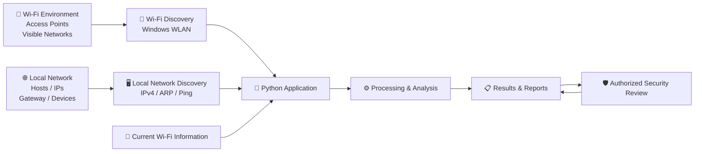
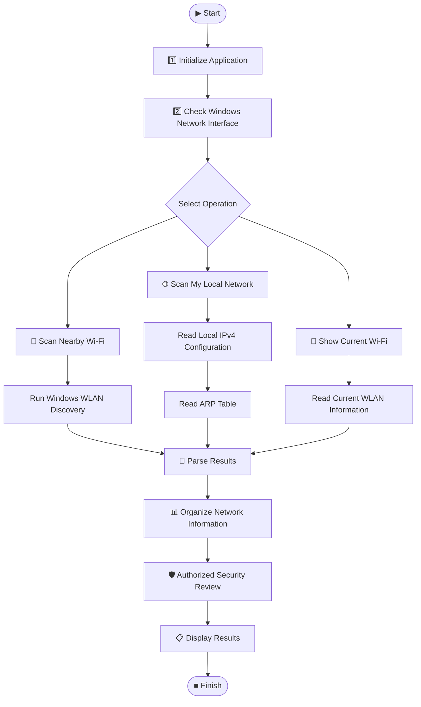

# wifi-discovery-local-network-audit
Windows Wi-Fi discovery and authorized local network auditing tool
# 🛡️ Wi-Fi Discovery & Local Network Audit

<p align="center">

**Windows Wi-Fi Discovery • Local Network Enumeration • Authorized Security Auditing**

A Python-based cybersecurity learning project for discovering nearby Wi-Fi networks and analyzing the local network in an authorized environment.

</p>

---

## ⚠️ Ethical Use & Legal Notice

> **AUTHORIZED USE ONLY**

This project is intended for:

- Educational cybersecurity laboratories
- Personal networks
- Authorized penetration testing
- Network administration
- Security research
- Defensive security learning

Only scan networks and systems that you **own or have explicit permission to assess**.

Do **not** use this project to access, disrupt, intercept, or attack networks without authorization.

---

# 📡 Project Overview

**Wi-Fi Discovery & Local Network Audit** is a Python-based Windows cybersecurity project designed to help students, security researchers, and network administrators understand Wi-Fi visibility and local-network discovery.

The project combines Python automation with native Windows networking commands to provide a simple security-lab environment.

### 🎯 Project Goals

- 📡 Discover nearby Wi-Fi networks
- 🔎 Inspect Wi-Fi security information
- 🌐 Identify the local IPv4 network
- 🖥️ Discover devices visible through the local ARP table
- 📋 Display local network configuration
- 🧪 Practice authorized security auditing
- 🐍 Learn Python security automation
- 🪟 Work with Windows networking and PowerShell
- 🛡️ Understand defensive network-security concepts

---

# 🚀 Features

## 📡 Wi-Fi Discovery

The Windows Wi-Fi module uses the native Windows WLAN interface to discover visible wireless networks.

Information can include:

- SSID
- BSSID
- Signal strength
- Channel
- Radio type
- Authentication
- Encryption

The scanner performs multiple discovery rounds and combines observed BSSIDs to reduce temporary scan misses.

---

## 🌐 Local Network Discovery

The project can inspect the computer's local IPv4 configuration and discover devices visible through the Windows ARP table.

Information can include:

- Computer hostname
- Local IPv4 address
- Subnet
- Default gateway
- MAC addresses
- Local devices
- Hostnames when available

The local-network scanner is intentionally bounded and uses simple discovery techniques suitable for a controlled lab environment.

---

## 🖥️ Windows Security Lab GUI

The Windows security-lab application provides a graphical interface for common discovery operations.

Available operations include:

- **Scan Nearby Wi-Fi**
- **Scan My Network**
- **Current Wi-Fi**
- **Clear**

The GUI is implemented with Python's Tkinter framework and runs Windows networking commands such as `netsh`, `ipconfig`, `arp`, `ping`, and `getmac`. :contentReference[oaicite:2]{index=2}

---

# 🧪 Cybersecurity Laboratory

This repository contains multiple scripts for practicing cybersecurity concepts in a controlled environment.

The laboratory focus includes:

- Wi-Fi discovery
- Network enumeration
- Local network analysis
- Windows networking
- Security auditing concepts
- Python automation
- Security-tool development

---

# 🏗️ Architecture Diagram



### Architecture Layers

| Layer | Purpose |
|---|---|
| 📡 Target Environment | Wi-Fi networks and local network |
| 🐍 Application Layer | Python scripts and GUI |
| 📶 Discovery Layer | Wi-Fi and local-network discovery |
| ⚙️ Processing Layer | Parse and organize network information |
| 📋 Output Layer | Human-readable scan results |
| 🛡️ Security Layer | Authorized security analysis |

---

# 🔄 Workflow Diagram



---

# 🔬 Detailed Workflow

```text
┌──────────────────────┐
│       START          │
└──────────┬───────────┘
           │
           ▼
┌──────────────────────┐
│ Initialize Python    │
│ Security Lab         │
└──────────┬───────────┘
           │
           ▼
┌──────────────────────┐
│ Check Windows Wi-Fi  │
│ Network Interface    │
└──────────┬───────────┘
           │
           ▼
     ┌───────────────┐
     │ Select Action │
     └───────┬───────┘
             │
     ┌───────┼────────┐
     │       │        │
     ▼       ▼        ▼
  Wi-Fi    Local    Current
  Scan     Network   Wi-Fi
     │       │        │
     ▼       ▼        ▼
  netsh   ipconfig   netsh
     │     arp       wlan
     │     ping      interfaces
     │       │        │
     └───────┼────────┘
             │
             ▼
     ┌────────────────┐
     │ Parse Results  │
     └───────┬────────┘
             │
             ▼
     ┌────────────────┐
     │ Analyze Data   │
     └───────┬────────┘
             │
             ▼
     ┌────────────────┐
     │ Display Output │
     └───────┬────────┘
             │
             ▼
        ┌─────────┐
        │  DONE   │
        └─────────┘
```

---

# 📂 Project Structure

```text
wifi-discovery-local-network-audit/
│
├── 📄 README.md
├── 📄 .gitignore
│
├── 🐍 kali_security_lab.py
├── 🪟 kali_security_lab_windows.py
├── 📡 wifi_authorized_audit.py
└── 📶 wifi_handshake_lab.py
```

---

# 🧰 Scripts

## `wifi_authorized_audit.py`

Main Wi-Fi and local-network auditing functionality.

Typical learning areas:

- Wi-Fi discovery
- Local network information
- Authorized network enumeration
- Security-oriented output

---

## `kali_security_lab.py`

Security-lab functionality designed for controlled cybersecurity experimentation.

---

## `kali_security_lab_windows.py`

Windows-oriented security-lab implementation.

The Windows GUI provides controls for:

```text
Scan Nearby Wi-Fi
Scan My Network
Current Wi-Fi
Clear
```

The application displays Windows WLAN and local-network information through a graphical interface. :contentReference[oaicite:3]{index=3}

---

## `wifi_handshake_lab.py`

Wi-Fi security laboratory component intended for controlled and authorized experimentation.

Use only with networks and wireless equipment that you own or have explicit authorization to test.

---

# 💻 Requirements

## Operating System

Recommended:

```text
Windows 10 / Windows 11
```

## Python

Python 3.x is recommended.

Check your Python installation:

```powershell
python --version
```

or:

```powershell
py --version
```

---

# ⚙️ Installation

Clone the repository:

```powershell
git clone https://github.com/chayanBisai/wifi-discovery-local-network-audit.git
```

Enter the project directory:

```powershell
cd wifi-discovery-local-network-audit
```

Check the files:

```powershell
dir
```

---

# ▶️ Running the Project

## Windows Security Lab

Run:

```powershell
python kali_security_lab_windows.py
```

or:

```powershell
py kali_security_lab_windows.py
```

The GUI should open.

---

## 📡 Wi-Fi Authorized Audit

Run:

```powershell
python wifi_authorized_audit.py
```

---

## 🐍 Kali Security Lab

Run:

```powershell
python kali_security_lab.py
```

---

## 🧪 Wi-Fi Handshake Lab

Run:

```powershell
python wifi_handshake_lab.py
```

> Use the laboratory functionality only in an isolated or explicitly authorized environment.

---

# 🖥️ Windows Commands Used

The Windows implementation relies on built-in networking utilities rather than requiring a large third-party dependency stack.

### Wi-Fi interface information

```powershell
netsh wlan show interfaces
```

### Nearby Wi-Fi networks

```powershell
netsh wlan show networks mode=bssid
```

### IPv4 configuration

```powershell
ipconfig
```

### ARP table

```powershell
arp -a
```

### Host reachability

```powershell
ping <IP_ADDRESS>
```

### Local MAC information

```powershell
getmac
```

These commands are used by the Windows application to collect and organize information for the authorized local-network lab. :contentReference[oaicite:4]{index=4} :contentReference[oaicite:5]{index=5}

---

# 📊 Information Flow

```text
Wi-Fi Adapter
      │
      ▼
Windows WLAN
      │
      ▼
Wi-Fi Discovery
      │
      ├── SSID
      ├── BSSID
      ├── Signal
      ├── Channel
      ├── Authentication
      └── Encryption
      │
      ▼
Python Parser
      │
      ▼
Security-Lab Output
```

Local-network discovery:

```text
Windows Network
      │
      ▼
IPv4 Configuration
      │
      ├── IP Address
      ├── Subnet
      └── Gateway
      │
      ▼
Local Host Discovery
      │
      ▼
ARP Table
      │
      ├── IP
      ├── MAC
      └── Device Type
      │
      ▼
Hostname Resolution
      │
      ▼
Audit Results
```

---

# 🔐 Security Design

This project intentionally focuses on **discovery and authorized auditing**.

The Windows GUI explicitly describes itself as an authorized local-network auditing tool and states that it does not perform deauthentication, credential capture, or password cracking. :contentReference[oaicite:6]{index=6}

### The project does NOT provide:

- ❌ Unauthorized network access
- ❌ Deauthentication attacks
- ❌ Credential theft
- ❌ Password cracking
- ❌ Persistence mechanisms
- ❌ Malware deployment

### The project focuses on:

- ✅ Discovery
- ✅ Enumeration
- ✅ Network visibility
- ✅ Security education
- ✅ Defensive analysis
- ✅ Authorized auditing

---

# 🛡️ Security Considerations

Wi-Fi discovery results are not necessarily a complete representation of the wireless environment.

Windows may temporarily miss networks because of:

- Adapter behavior
- Signal conditions
- Channel availability
- Driver limitations
- Environmental interference

Likewise, ARP discovery does not guarantee that every device connected to a network will appear. Devices may be hidden by:

- Client isolation
- Host firewalls
- Sleep states
- Network configuration
- VLAN boundaries
- Other security controls

The application itself notes these limitations when presenting local-network results. :contentReference[oaicite:7]{index=7}

---

# 🧪 Example Laboratory Workflow

```text
1. Connect to your authorized Wi-Fi laboratory network
                     │
                     ▼
2. Start the Windows Security Lab
                     │
                     ▼
3. Select "Current Wi-Fi"
                     │
                     ▼
4. Review connection information
                     │
                     ▼
5. Select "Scan Nearby Wi-Fi"
                     │
                     ▼
6. Review visible wireless networks
                     │
                     ▼
7. Select "Scan My Network"
                     │
                     ▼
8. Review local IPv4 and ARP information
                     │
                     ▼
9. Analyze the results
                     │
                     ▼
10. Document security observations
```

---

# 📸 Project Screenshots

Add your screenshots to a folder such as:

```text
docs/
├── architecture.png
├── workflow.png
└── application.png
```

Then add them to this section:

```markdown
## 📸 Screenshots

### 🖥️ Application


### 🏗️ Architecture


### 🔄 Workflow


```

---

# 🧭 Learning Objectives

This project can be used to practice:

### Python

- File organization
- Functions and classes
- Threading
- Subprocess execution
- Regular expressions
- Network address processing
- GUI development with Tkinter

### Networking

- SSID and BSSID
- Wi-Fi channels
- Signal strength
- IPv4 addressing
- Subnets
- Default gateways
- ARP
- MAC addresses
- Hostname resolution

### Cybersecurity

- Reconnaissance concepts
- Network enumeration
- Security auditing
- Asset visibility
- Defensive network analysis
- Authorized penetration-testing methodology

---

# 📚 Key Concepts

| Concept | Description |
|---|---|
| **SSID** | Name of a wireless network |
| **BSSID** | Identifier/MAC address associated with a Wi-Fi access point |
| **RSSI** | Received signal-strength measurement |
| **ARP** | Protocol used for IPv4 address-to-MAC resolution |
| **Gateway** | Device that forwards traffic outside the local network |
| **Subnet** | Defines the boundaries of an IP network |
| **MAC Address** | Hardware/network interface identifier |
| **Network Enumeration** | Collecting information about visible network assets |

---

# 🛠️ Troubleshooting

## Python is not recognized

Try:

```powershell
py --version
```

If that works, use:

```powershell
py kali_security_lab_windows.py
```

---

## Wi-Fi scan returns no networks

Check:

```powershell
netsh wlan show interfaces
```

Make sure the Windows Wi-Fi adapter is enabled.

Then try:

```powershell
netsh wlan show networks mode=bssid
```

---

## Local network scan cannot determine the network

Check:

```powershell
ipconfig
```

Confirm that the Wi-Fi adapter has:

- IPv4 address
- Subnet mask
- Default gateway

---

## No devices appear in the local scan

Check:

```powershell
arp -a
```

Remember that ARP-based discovery does not guarantee visibility of every device on the network.

---

# 🔒 `.gitignore`

Sensitive or generated local files should not be committed.

Recommended exclusions include:

```gitignore
# Python
__pycache__/
*.pyc
.venv/
venv/

# Secrets
.env
.env.*
*.key
*.pem

# Local scan/output files
pass_10000000_lab.txt
scan_results/
*.log
*.csv
*.json

# Personal configuration
config.local.py
settings.local.py
```

> Never commit passwords, private keys, API tokens, captured credentials, or other sensitive data.

---

# 📈 Future Improvements

Possible future development:

- [ ] Export scan results to a safe report format
- [ ] Add network-device categorization
- [ ] Add vendor lookup for MAC addresses
- [ ] Improve Wi-Fi signal visualization
- [ ] Add scan history
- [ ] Add structured JSON export for non-sensitive lab data
- [ ] Add defensive security recommendations
- [ ] Add unit tests
- [ ] Add automated documentation
- [ ] Improve cross-platform support
- [ ] Add a dedicated laboratory mode

---

# 🧑‍💻 Technologies

```text
Python 3
Tkinter
Windows WLAN / netsh
IPv4
ARP
PowerShell
Windows Networking
Git
GitHub
```

---

# 📜 Project Philosophy

```text
DISCOVER
   ↓
ANALYZE
   ↓
AUDIT
   ↓
SECURE
```

The goal is not simply to scan networks.

The goal is to understand how network information can be collected, interpreted, and used to improve security.

---

# ⚖️ Responsible Security

> **Learn ethically. Test responsibly. Protect privacy.**

Use this project only against:

- Your own devices
- Your own Wi-Fi network
- Your own laboratory environment
- Systems for which you have explicit authorization

Unauthorized access or interference with computer systems and networks may be illegal.

---

# ⭐ Project

If this project helps you learn Python, networking, or cybersecurity, consider giving the repository a ⭐ on GitHub.

---

## 🛡️ Wi-Fi Discovery & Local Network Audit

**Discover • Analyze • Audit • Secure**

Built for cybersecurity education and authorized security testing.
